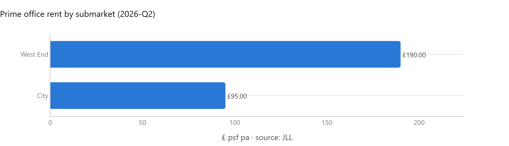
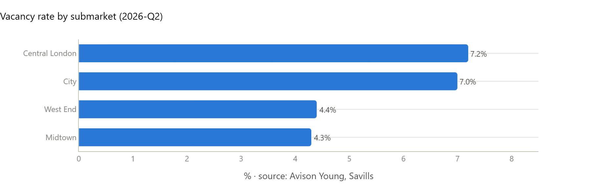
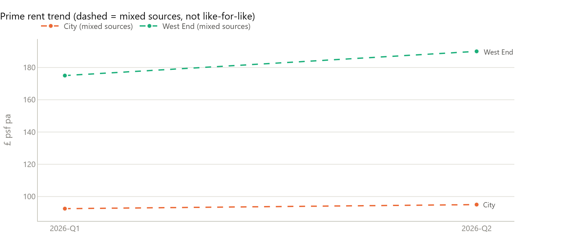
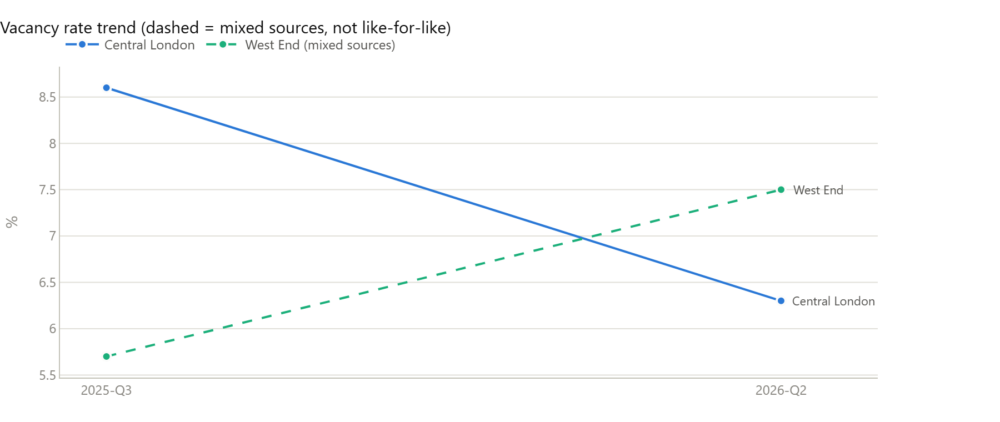
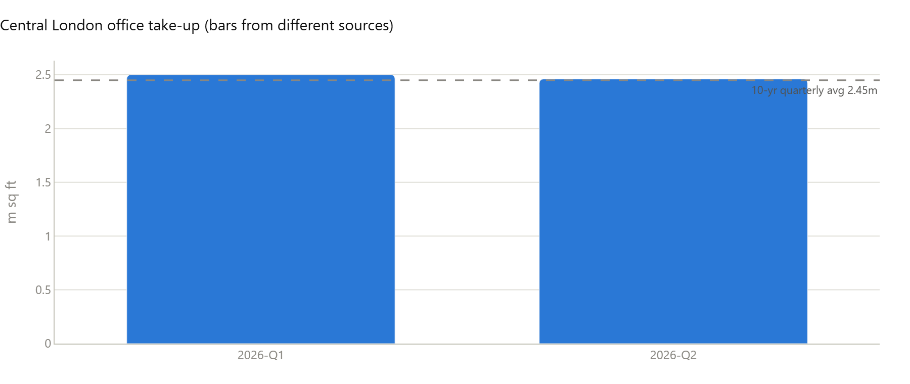
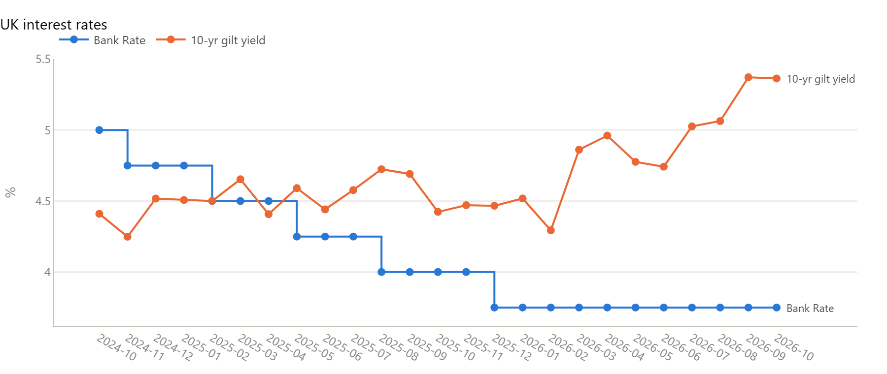

# London Office Market Brief - October 2026

_Generated 08 October 2026, 07:09 · run `20261008T070945-5e5fe0`_

| Indicator | Value | Change | Period | Source |
|---|---|---|---|---|
| Prime rent - West End | £190.00 psf | - | 2026-Q2 | JLL |
| Prime rent - City | £95.00 psf | - | 2026-Q2 | JLL |
| Vacancy - Central London | 7.2% | -2.30pp vs 2025-Q3 | 2026-Q2 | Savills |
| Take-up - latest quarter | 2,600,000 sq ft | +4.0% vs 2026-Q1 (BNP Paribas Real Estate, not like-for-like) | 2026-Q2 | Avison Young |
| Bank Rate | 3.75% | +0.00pp vs 2026-09 | 2026-10 | Bank of England |

## Executive summary

Occupier fundamentals for prime London offices are strong, but the capital-markets backdrop has weakened sharply. The 10-year gilt reached 5.36% on 5 October 2026, up from about 4.5% in March, with Bank Rate held at 3.75% and the BoE signalling that rates may rise. The latest verified occupier data is Q2 2026, as Q3 broker reports are not yet published. We read this as supporting continued prime rental growth and early pre-letting, as Jane Street's 465k sq ft pre-let at One Spitalfields shows. The main risk is that yields move out faster than rents grow: Q2 core prime yields of 3.75% (West End) and 5.50% (City) predate most of the gilt rise, and investment volumes remain 15–30% below average on different broker measures.

**Key takeaways**

- Financing costs are the key near-term swing factor. The 10-year gilt is 5.36% (5 Oct 2026), up about 90bp in 12 months and about 29bp in the last month. Bank Rate has been held at 3.75% since January, CPIH has rebounded to 3.3% (Aug, from 2.8% in June), and FT reporting (headlines only) flags a possible November hike. The West End core prime yield of 3.75% (C&W, Q2) now sits below the gilt.
- A supply gap is building for 2027–29. H1 2026 starts were 1.5m sq ft, with one new-build (Delta, Paddington) and 14 refurbishments. 28% of the 22m sq ft pipeline to 2029 has not started, rising to 77% for 2029 schemes. In the near term, however, 2026 completions are a record 7.7m sq ft, of which only 35% is pre-let (Savills).

## What changed

- UK CPIH inflation rose from 3.1% (July 2026) to 3.3% (August 2026).
- Midtown vacancy fell from 4.9% (Q1 2026) to 4.3% (Q2 2026) on Avison Young's measure.
- Central London take-up: 2.5m to 2.6m sq ft (Q1 to Q2 2026) [different sources: BNP Paribas Real Estate to Avison Young; partly definitional]. This is not a like-for-like move.
- West End vacancy: 5.7% to 4.4% (Q3 2025 to Q2 2026) [different sources: Avison Young to Savills; partly definitional]. The Savills figure covers the West End Core (Mayfair/St James's) only.

## Risks & opportunities

| Type | Severity | Signal | Submarket | Rationale |
|---|---|---|---|---|
| Risk | High | Gilt surge and possible BoE hike pressure capital values | Central London | The 10-year gilt is at 5.36%, up from about 4.5% in March, and FT headlines point to a possible November hike. Core prime yields of 3.75% (West End) and 5.50% (City) at Q2 predate most of this move. In our interpretation, yields are more likely to soften unless rental growth offsets the rise; prime yield data after September is not yet available. |
| Risk | Medium | Record 2026 completions and West End fringe overhang | West End | 7.7m sq ft is due to complete in 2026, only 35% of it pre-let. West End vacancy is 190 bps above its 10-year average, and Hammersmith (22%) and VNEB (18%) are very weak. Speculative space delivering into the fringe faces near-term letting competition and long incentives. |
| Risk | Medium | Secondary obsolescence and MEES EPC B stranding | Central London | Occupiers are concentrating on new and refurbished space, which made up 69.6% of Q2 take-up. Refurbished-space vacancy is up 90bps year on year to 4.4%. EPC B will apply to rented buildings over 1,000 sq m from 2030/31, pending secondary legislation, so lower-rated stock faces capex, value discounts and possible business-rates effects. Green Street auction coverage (unverified) points to pressure on secondary pricing. |
| Risk | Medium | Development cost and delivery risk | Central London | Cost, labour, MEP and debt constraints are delaying schemes; 77% of 2029 completions have not started. CPIH has rebounded to 3.3%, which may add to cost pressure. This raises programme and viability risk for our own schemes, although it also limits competing supply. |
| Risk | Medium | Demand conversion and sector concentration | City | City take-up was 1.36m sq ft in Q2, down 35% year on year. About half of active requirements relate to lease events in 2029 or later. King's Cross momentum depends heavily on AI occupiers. Record requirements may convert to lettings more slowly than headline demand suggests. |
| Opportunity | Medium | Repricing and retrofit entry points for long-term capital | City | Higher debt costs may force sales by leveraged owners. The confirmed EPC B timetable, with the 2027 step dropped, makes retrofit capex easier to price. City trophy sales of about £330m (10 Gresham Street) and about £440m (2 Aldermanbury Square) will provide pricing evidence for core acquisitions. |

## Market charts

## Research by topic

### Office Rents

**(Headline removed: it quoted licence-restricted sources.)**

I did not find Q3 2026 broker reports. Cross-broker figures differ: JLL has the West End at £190 and the City at £95, and Savills' average Grade A figures are far lower than prime.

- City take-up was weak in Q2 (1.36m sq ft, down 35% year on year), but active requirements doubled year on year to 9.26m sq ft.
- I did not find Shoreditch & Fringe prime rent or a stated prime_rent_growth_yoy in the sources I read.

| Metric | Submarket | Value | Period | Source |
|---|---|---|---|---|
| prime rent | West End | 190 GBP psf pa | 2026-Q2 | [JLL](https://www.jll.co.uk/en/trends-and-insights/research/q3-2023-central-london-office-market-report) |
| prime rent | City | 95 GBP psf pa | 2026-Q2 | [JLL](https://www.jll.co.uk/en/trends-and-insights/research/q3-2023-central-london-office-market-report) |
| grade a rent | City | 74.34 GBP psf pa | 2025-Q4 | [Savills](https://www.savills.co.uk/research_articles/229130/386949-0) |
| grade a rent | West End | 99.58 GBP psf pa | 2025-Q4 | [Savills](https://www.savills.co.uk/research_articles/229130/386949-0) |

_Confidence 70%_

### Vacancy Availability

**(Headline removed: it quoted licence-restricted sources.)**

Savills puts Central London supply at 18.7m sq ft (vacancy 7.2%, down 20 bps on the quarter and 80 bps above the long-term average). Avison Young records 6.3%, unchanged on the quarter. The definitions differ, so the figures are not comparable. Savills shows the City at 7.0% and City Core at 5.9%. The West End is falling but is still 190 bps above its 10-year average, with record completions expected. Active demand is at a record 15.7m sq ft, so quality space is scarce even though headline vacancy is above average. I did not find a Grade A share of availability, new-build vacancy or Canary Wharf figures in the sources I read.

- Savills Q2 2026: Central London supply is 18.7m sq ft, down 0.5m sq ft on Q1. Vacancy is 7.2%, 80 bps above the long-term average.
- Savills: West End Core (Mayfair/St James's) vacancy is 4.4%. West End Fringe areas are much weaker, with Hammersmith at 22% and VNEB at 18%. West End overall is 190 bps above its 10-year average, and record completions will keep supply elevated.
- 43% of supply (8.0m sq ft) is BREEAM Excellent or Outstanding. 51% of supply is floorplates under 5,000 sq ft. 42.5% of sub-10,000 sq ft options are fitted, CAT A+ or managed.
- Savills forecasts record completions of 7.7m sq ft in 2026, of which 35% is pre-let. Under construction is 16.1m sq ft (about a quarter pre-let). H1 starts were weak at 1.5m sq ft, which could tighten supply from 2027 onwards.

| Metric | Submarket | Value | Period | Source |
|---|---|---|---|---|
| vacancy rate | Central London | 7.2 % | 2026-Q2 | [Savills](https://www.savills.co.uk/research_articles/229130/393427-0) |
| availability sqft | Central London | 1.87e+07 sq ft | 2026-Q2 | [Savills](https://www.savills.co.uk/research_articles/229130/393427-0) |
| vacancy rate | City | 7 % | 2026-Q2 | [Savills](https://www.savills.co.uk/research_articles/229130/393427-0) |
| vacancy rate | West End | 4.4 % | 2026-Q2 | [Savills](https://www.savills.co.uk/research_articles/229130/393427-0) |
| vacancy rate | Central London | 6.3 % | 2026-Q2 | [Avison Young](https://www.avisonyoung.co.uk/central-london-office-analysis) |
| vacancy rate | Central London | 8.6 % | 2026-Q2 | [JLL](https://www.jll.co.uk/en/trends-and-insights/research/q3-2023-central-london-office-market-report) |
| active demand sqft | Central London | 1.57e+07 sq ft | 2026-Q2 | [Savills](https://www.savills.co.uk/research_articles/229130/393427-0) |

_Confidence 60%_

### Leasing Take Up

**Q3 2026 broker data was not yet available.**

The latest full broker data is Q2 2026, and the Q3 reports are not yet published. Take-up recovered after a subdued Q1. Definitions differ, so the figures are kept separate. AI and TMT occupiers drove the quarter, mainly in King's Cross/Euston. Q3 is already showing very large pre-lets, led by Jane Street's 465,000 sq ft at One Spitalfields in the City.

- Top Q3 deal: Jane Street pre-let 465k sq ft at One Spitalfields (City), JPMAM's redevelopment due to complete 2029. It is the City's largest off-plan pre-let in over a decade and shows occupiers securing scarce future supply. Jane Street takes over A&O Shearman's space, which A&O vacates in May 2027.

| Metric | Submarket | Value | Period | Source |
|---|---|---|---|---|
| take up sqft | Central London | 2.6e+06 sq ft | 2026-Q2 | [Avison Young](https://www.avisonyoung.co.uk/central-london-office-analysis) |
| take up vs 10y avg | Central London | 6 % | 2026-Q2 | [Avison Young](https://www.avisonyoung.co.uk/central-london-office-analysis) |
| take up sqft | Central London | 2.6e+06 sq ft | 2026-Q2 | [JLL](https://www.jll.co.uk/en/trends-and-insights/research/q3-2023-central-london-office-market-report) |
| take up sqft | Central London | 2.46e+06 sq ft | 2026-Q2 | [Cushman & Wakefield](https://www.cushmanwakefield.com/en/united-kingdom/insights/uk-marketbeat/london-office-marketbeat) |
| vacancy rate | Central London | 6.3 % | 2026-Q2 | [Avison Young](https://www.avisonyoung.co.uk/central-london-office-analysis) |
| vacancy rate | Midtown | 4.3 % | 2026-Q2 | [Avison Young](https://www.avisonyoung.co.uk/central-london-office-analysis) |
| prime rent | West End | 190 GBP psf pa | 2026-Q2 | [JLL](https://www.jll.co.uk/en/trends-and-insights/research/q3-2023-central-london-office-market-report) |
| prime rent | City | 95 GBP psf pa | 2026-Q2 | [JLL](https://www.jll.co.uk/en/trends-and-insights/research/q3-2023-central-london-office-market-report) |
| prime rent growth yoy | Central London | 6.5 % | 2026-Q2 | [Avison Young](https://www.avisonyoung.co.uk/central-london-office-analysis) |

_Confidence 70%_

### Supply Pipeline

**Central London has 14–16m sq ft under construction (about 75% speculative), starts are collapsing and almost all new starts are refurbishments, so a 2027–29 supply gap is building even as 2026 completions hit a record.**

At Q2 2026 (end H1), Savills puts Central London space under construction at 16.1m sq ft, with about a quarter pre-let. The two sources are kept separate and not averaged. H1 2026 starts fell sharply to 1.5m sq ft. Only one new-build started (Delta, Paddington) and the other 14 starts were refurbishments. 2026 completions are set at a record 7.7m sq ft (Savills), but 35% of that is pre-let. Beyond 2026, 22m sq ft is scheduled to complete by 2029 (148 schemes). Of that, 28% has not started on site (77% for 2029 completions) and only 18% is pre-let. Against that, active demand is a record 15.7m sq ft and vacancy is falling.

- Starts: H1 2026 starts were 1.5m sq ft across Central London, with only one new-build (Delta, Paddington, 234k sq ft) and 14 refurbishments. West End starts were 676k sq ft, down 40% on H1 2025. City starts were 0.9m sq ft, all refurbishments. This points to a supply gap from 2028 onward.
- Deloitte Crane Survey (reported April 2026): new London office starts in 2025 fell 35% to 4.8m sq ft, from 7.5m in 2024 and 8.7m in 2023. The five-year average is 6.5m.
- Savills' realistic pipeline is 22m sq ft across 148 schemes to end-2029. 28% has not started on site (77% of 2029 schemes) and only 18% is pre-let, which is 5 points below the typical level. Delays and withdrawals are likely given construction cost, labour, MEP and debt constraints.
- Record 2026 completions (7.7m sq ft Central London) are partly absorbed by pre-lets (35%). West End vacancy is still 190 bps above its 10-year average, so West End fringe and speculative supply faces short-term letting competition. Core markets are tight: 50% of Mayfair's 2026–29 pipeline and 76% of St James's is pre-let or under offer.
- Data gap: I did not find a year-by-year split of pre-let versus speculative completions for 2027–2029. The pipeline_prelet_sqft and pipeline_speculative_sqft metrics are therefore not populated, apart from the aggregate figures above. Savills' Q1 note said about two-thirds of 2026 completions were pre-let with only 1.3m sq ft speculative still to be added; the Q2 note says 35% pre-let, so the figures are not consistent between quarters.

| Metric | Submarket | Value | Period | Source |
|---|---|---|---|---|
| under construction sqft | Central London | 1.61e+07 sq ft | 2026-Q2 | [Savills](https://www.savills.co.uk/research_articles/229130/393427-0) |
| pre let share | Central London | 25 % | 2026-Q2 | [Savills](https://www.savills.co.uk/research_articles/229130/393427-0) |
| under construction sqft | City | 9.7e+06 sq ft | 2026-Q2 | [Savills](https://www.savills.co.uk/research_articles/229130/393406-0) |
| pre let share | City | 28 % | 2026-Q2 | [Savills](https://www.savills.co.uk/research_articles/229130/393406-0) |
| completions sqft | Central London | 7.7e+06 sq ft | 2026 | [Savills](https://www.savills.co.uk/research_articles/229130/393427-0) |
| completions sqft | City | 4.06e+06 sq ft | 2026 | [Savills](https://www.savills.co.uk/research_articles/229130/393406-0) |
| completions sqft | West End | 3.82e+06 sq ft | 2026 | [Savills](https://www.savills.co.uk/research_articles/229130/393406-0) |
| active demand sqft | Central London | 1.57e+07 sq ft | 2026-Q2 | [Savills](https://www.savills.co.uk/research_articles/229130/393427-0) |
| vacancy rate | Central London | 7.2 % | 2026-Q2 | [Savills](https://www.savills.co.uk/research_articles/229130/393427-0) |
| vacancy rate | City | 7 % | 2026-Q2 | [Savills](https://www.savills.co.uk/research_articles/229130/393406-0) |
| vacancy rate | West End | 7.5 % | 2026-Q2 | [Savills](https://www.savills.co.uk/research_articles/229130/393406-0) |

_Confidence 72%_

### Submarket Dynamics

**The City and West End cores are tight, and Canary Wharf is re-rating from a low base.**

The City Core and West End Core were below their take-up averages, but under-offer space should correct that. King's Cross/Euston was strongest, driven by AI occupiers (Anthropic, OpenAI). I did not obtain a per-submarket vacancy or take-up table. That gap, and the lack of Q3 data, lowers my confidence.

- Midtown and Bloomsbury: Clerkenwell/Farringdon take-up was strong. Bloomsbury prime rent rose 6.1% to £87.50 (Cohere deal at £91). Midtown vacancy was 4.9% in Q1 2026 (Avison Young).
- Spillover: demand that cannot be met in the City and West End cores is moving to adjacent fringe locations, supporting rents for best-in-class space there.
- Not found: Q3 2026 data, per-submarket vacancy and take-up tables, and prime yields.

| Metric | Submarket | Value | Period | Source |
|---|---|---|---|---|
| prime rent | West End | 190 GBP psf pa | 2026-Q2 | [JLL](https://www.jll.co.uk/en/trends-and-insights/research/q3-2023-central-london-office-market-report) |
| prime rent | City | 95 GBP psf pa | 2026-Q2 | [JLL](https://www.jll.co.uk/en/trends-and-insights/research/q3-2023-central-london-office-market-report) |

_Confidence 60%_

### Macro Economy

**Bank Rate is on hold at 3.75%, but the 10-year gilt has jumped to about 5.36% and the BoE is signalling possible hikes, which pressures London office pricing.**

Bank Rate has been 3.75% since January 2026 and was held again in September and on 6 October. The 10-year gilt par yield rose from about 4.5% in March to 5.36% on 5 October 2026, with most of the rise since September. CPIH inflation is 3.3% in August, up from 2.8% in June. Q2 GDP growth was solid at 0.5% q/q. UK unemployment is 4.9%, and the London employment rate has drifted down to 74.8%. FT commentary says the BoE signalled higher borrowing costs and that a November hike is possible if energy prices stay high. The BoE September summary/minutes and the FT/BNP items were seen only as headlines or snippets, not read in full.

- Bank Rate: 4.00% in Nov-Dec 2025, cut to 3.75% in Jan 2026, unchanged since (latest 2026-10-06).
- 10-year gilt: 4.44% (Nov 2025), about 4.5% (Mar 2026), 4.87% (Apr), 5.07% (Sep), 5.36% (5 Oct 2026). This is a sharp rise of about 90bp in 12 months and about 29bp in the last month.
- SONIA is about 3.73%, tracking Bank Rate. The market is pricing hikes, so the curve is inverted (10-year gilt about 160bp above SONIA), which raises the cost of fixed-rate and long-term debt.
- CPIH has fallen from 4.1% (Sep 2025) to 2.8% (Jun 2026) and is now rebounding (3.1% in July, 3.3% in August). That is consistent with the energy-price shock mentioned in FT headlines.
- GDP: +0.6% in Q1 and +0.5% in Q2 2026, following flat Q4 2025. This is a supportive demand backdrop.
- Unemployment is stable at 4.9% (down from a 5.2% peak in late 2025). The London 16-64 employment rate slipped from 75.5% (Jul 2024-Jun 2025) to 74.8% (Apr 2025-Mar 2026), a mild negative for office demand.
- FT commentary (headlines/snippets, not read in full): the BoE held at 3.75% on 17 Sep and signalled higher borrowing costs. FT Monetary Policy Radar expects a November hike if energy prices stay high. An older FT survey expected the 10-year gilt to fall to 4.32% by end-2026, but this looks stale given the actual 5.36%.
- Prime office yields were not collected in this skill, so the yield-gilt spread cannot be calculated. With the gilt at 5.36%, the spread is likely thin or negative unless rental growth compensates.
- Watch list: the BoE November MPC decision, the September CPI release, labour market and GDP releases. The ONS RSS feed showed no major scheduled releases beyond minor items.

| Metric | Submarket | Value | Period | Source |
|---|---|---|---|---|
| bank rate | UK | 3.75 % | 2026-10 | [Bank of England](https://www.bankofengland.co.uk/boeapps/database/_iadb-fromshowcolumns.asp?csv.x=yes&Datefrom=01%2FOct%2F2025&Dateto=now&SeriesCodes=IUDBEDR&CSVF=TN&UsingCodes=Y&VPD=Y&VFD=N) |
| gilt 10y yield | UK | 5.363 % | 2026-10 | [Bank of England](https://www.bankofengland.co.uk/boeapps/database/_iadb-fromshowcolumns.asp?csv.x=yes&Datefrom=01%2FOct%2F2025&Dateto=now&SeriesCodes=IUDMNPY&CSVF=TN&UsingCodes=Y&VPD=Y&VFD=N) |
| sonia | UK | 3.732 % | 2026-10 | [Bank of England](https://www.bankofengland.co.uk/boeapps/database/_iadb-fromshowcolumns.asp?csv.x=yes&Datefrom=01%2FOct%2F2025&Dateto=now&SeriesCodes=IUDSOIA&CSVF=TN&UsingCodes=Y&VPD=Y&VFD=N) |
| cpih yoy | UK | 3.3 % | 2026-08 | [ONS](https://www.ons.gov.uk/economy/inflationandpriceindices/timeseries/l55o/mm23) |
| gdp growth qoq | UK | 0.5 % | 2026-Q2 | [ONS](https://www.ons.gov.uk/economy/grossdomesticproductgdp/timeseries/ihyq/qna) |
| unemployment rate | UK | 4.9 % | 2026-06 | [ONS](https://www.ons.gov.uk/employmentandlabourmarket/peoplenotinwork/unemployment/timeseries/mgsx/lms) |
| london employment rate | London | 74.8 % | 2026-03 | [ONS (Nomis APS)](https://www.nomisweb.co.uk/) |

_Confidence 80%_

### Occupier Demand

**Flight to quality remains dominant (77% of Q2 2026 Central London take-up was Grade A), and government has now set EPC B for large rented offices from 2030/31, dropping the 2027 EPC C step.**

Cushman & Wakefield reports Q2 2026 Central London take-up of 2.46m sq ft, in line with the 5-year average, with 77% in Grade A space. Under offers rose to 4.44m sq ft, the highest since 2007, and are driven by large occupiers in the Wider City and Canary Wharf. The 2027 interim EPC C milestone was dropped, and the rules need secondary legislation. I did not find submarket-level Grade A shares or a green rent premium in this session, so those are gaps.

- Flight to quality: Grade A was 77% of Central London take-up in Q2 2026 (C&W). C&W's August 2025 release put the record at 80%, so the share is high and stable. I only saw the headline of that release and did not read it.
- Supply squeeze: the development pipeline is thinning on viability, and AI occupiers are adding to demand from banking/finance and legal. Large occupiers are searching early and signing off-plan pre-lets. C&W says 2026 could exceed the 10-year average of 3.5 off-plan pre-lets. That supports prime development and refurbishment economics.
- C&W London Moves 2026: deals over 100,000 sq ft increased, and the average distance moved was the lowest on record ('loyalty to local'). 312 companies expanded and 76 contracted, a net expansion of 3.8m sq ft. Occupiers are staying in established locations and upsizing into quality rather than shrinking.

| Metric | Submarket | Value | Period | Source |
|---|---|---|---|---|
| take up sqft | Central London | 2.46e+06 sq ft | 2026-Q2 | [Cushman & Wakefield](https://www.cushmanwakefield.com/en/united-kingdom/insights/uk-marketbeat/london-office-marketbeat) |
| under offer sqft | Central London | 4.44e+06 sq ft | 2026-Q2 | [Cushman & Wakefield](https://www.cushmanwakefield.com/en/united-kingdom/insights/uk-marketbeat/london-office-marketbeat) |
| availability sqft | Central London | 2.641e+07 sq ft | 2026-Q2 | [Cushman & Wakefield](https://www.cushmanwakefield.com/en/united-kingdom/insights/uk-marketbeat/london-office-marketbeat) |
| under construction sqft | Central London | 1.162e+07 sq ft | 2026-Q2 | [Cushman & Wakefield](https://www.cushmanwakefield.com/en/united-kingdom/insights/uk-marketbeat/london-office-marketbeat) |
| prime yield | City | 5.5 % | 2026-Q2 | [Cushman & Wakefield](https://www.cushmanwakefield.com/en/united-kingdom/insights/uk-marketbeat/london-office-marketbeat) |
| prime yield | West End | 3.75 % | 2026-Q2 | [Cushman & Wakefield](https://www.cushmanwakefield.com/en/united-kingdom/insights/uk-marketbeat/london-office-marketbeat) |

_Confidence 60%_

### News Events

**Q3 2026 data isn't out yet, but Q2 2026 shows prime yields stable (City 5.50%, West End 3.75%) and H1 investment of £4.02bn. The September news flow is City-led, with two deals of about £330m and £440m.**

The latest published quarterly picture is Q2 2026. I found no Q3 2026 investment volume or yield data in any source, so none is reported here. Cushman & Wakefield puts H1 2026 Central London investment at £4.02bn, down 15% on H1 2025 and 15% below the 5-year H1 average. Its core prime yields held at 5.50% in the City and 3.75% in the West End. Occupier momentum is strong: under-offers reached 4.44m sq ft, the highest since 2007, led by large Wider City and Canary Wharf deals. In September, City trophy assets came to market, with Moody's HQ marketed at about £330m and Clifford Chance's HQ in talks at about £440m. The Green Street piece on the secondary-office auction market suggests pricing pressure at the weaker end, but I did not read it. The Savills September Market Watch and Colliers September snapshot appeared in the feeds, but their pages did not load, so their figures are not used.

- [2026-09-16] CBRE is marketing Moody's European HQ at 10 Gresham Street, EC2 for about £330m. The building is fully let, and KWAP bought it in 2012 for £200m. It gives City pricing evidence, and Moody's moved there from Canary Wharf. Source: Property Week / Bloomberg
- [Q2 2026] Cushman & Wakefield: under-offers rose to 4.44m sq ft, the highest since 2007. Examples include Macfarlanes at 250,000 sq ft at 1 St Martin's Le Grand, PwC at 325,000 sq ft at One Eden in Canary Wharf, and Stripe at Broadgate. Several are off-plan pre-lets (City, Canary Wharf). Source: Cushman & Wakefield
- [Q2 2026] Cushman & Wakefield: availability was 26.41m sq ft, and 11.62m sq ft is under construction, of which only 25% is pre-let or under offer. The pipeline is thinning on viability, which supports a supply-crunch thesis. Source: Cushman & Wakefield
- [Q2 2026] Avison Young: take-up was 2.6m sq ft (6% above the 10-year average), vacancy 6.3% and Central London rental growth 6.5% year on year. Cushman & Wakefield's take-up of 2.46m sq ft is in line with its 5-year average, so the brokers' measures differ. Source: Avison Young
- [2026-10-07] Green Street News is running a piece on what auctions reveal about the secondary office market. It is an early read on lower-quality stock pricing and distress, and I did not read the article. Source: Green Street News

| Metric | Submarket | Value | Period | Source |
|---|---|---|---|---|
| investment volume gbp | Central London | 4.02e+09 GBP | 2026-H1 | [Cushman & Wakefield](https://www.cushmanwakefield.com/en/united-kingdom/insights/uk-marketbeat/london-office-marketbeat) |
| prime yield | City | 5.5 % | 2026-Q2 | [Cushman & Wakefield](https://www.cushmanwakefield.com/en/united-kingdom/insights/uk-marketbeat/london-office-marketbeat) |
| prime yield | West End | 3.75 % | 2026-Q2 | [Cushman & Wakefield](https://www.cushmanwakefield.com/en/united-kingdom/insights/uk-marketbeat/london-office-marketbeat) |

_Confidence 55%_

## Watch list

- Bank of England November 2026 MPC decision. A hike is possible if energy prices stay high (FT, headlines only); watch also the 10-year gilt against the 5.36% level of 5 October.
- ONS September CPI/CPIH release, plus upcoming labour market and GDP releases (CPIH was 3.3% in August).
- Outcomes of the 2 Aldermanbury Square sale (about £440m, Rothesay in talks) and the 10 Gresham Street marketing (about £330m), as tests of City pricing against the 5.50% prime yield.
- Secondary legislation implementing MEES EPC B by 2030/31 for rented offices over 1,000 sq m.
- Conversion of large under-offer deals (PwC 325k sq ft at One Eden, Macfarlanes 250k sq ft at 1 St Martin's Le Grand, Stripe at Broadgate), and letting progress on the 4.9m sq ft of H2 2026 completions.

## Sources

1. [Central London Office Analysis Q2 2026](https://www.avisonyoung.co.uk/central-london-office-analysis) - Avison Young
2. [Bank of England Bank Rate (IUDBEDR)](https://www.bankofengland.co.uk/boeapps/database/_iadb-fromshowcolumns.asp?csv.x=yes&Datefrom=01%2FOct%2F2025&Dateto=now&SeriesCodes=IUDBEDR&CSVF=TN&UsingCodes=Y&VPD=Y&VFD=N) - Bank of England, 2026-10-06
3. [Bank rate maintained at 3.75% - September 2026 MPC Summary](https://www.bankofengland.co.uk/monetary-policy-summary-and-minutes/2026/september-2026) - Bank of England, 2026-09-17
4. [BoE 10-year gilt par yield](https://www.bankofengland.co.uk/boeapps/database/_iadb-fromshowcolumns.asp?csv.x=yes&Datefrom=01%2FOct%2F2025&Dateto=now&SeriesCodes=IUDMNPY&CSVF=TN&UsingCodes=Y&VPD=Y&VFD=N) - Bank of England, 2026-10-05
5. [London Offices Snapshot July 2026](https://www.colliers.com/en-gb/research/london-offices-snapshot-july-2026) - Colliers
6. [London Moves 2026](https://www.cushmanwakefield.com/en/united-kingdom/insights/london-moves) - Cushman & Wakefield
7. [UK London Office Marketbeat Q2 2026](https://www.cushmanwakefield.com/en/united-kingdom/insights/uk-marketbeat/london-office-marketbeat) - Cushman & Wakefield
8. [FT: Bank of England says rates likely to rise as it overhauls gilt sales (UK interest rates page)](https://www.ft.com/uk-interest-rates) - Financial Times, 2026-10-02
9. [Central London Office Market Dynamics Q2 2026](https://www.jll.co.uk/en/trends-and-insights/research/q3-2023-central-london-office-market-report) - JLL
10. [CPIH annual rate](https://www.ons.gov.uk/economy/inflationandpriceindices/timeseries/l55o/mm23) - ONS
11. [Government sets out long-awaited MEES requirements for commercial buildings](https://www.propertyweek.com/news/government-sets-out-long-awaited-mees-requirements-for-commercial-buildings) - Property Week, 2026-06-18
12. [Jane Street signs mammoth pre-let for new London HQ at One Spitalfields](https://www.propertyweek.com/news/jane-street-signs-mammoth-pre-let-for-new-london-hq-at-one-spitalfields) - Property Week, 2026-09-24
13. [Moody's City headquarters hits the market for £330m](https://www.propertyweek.com/news/moodys-city-headquarters-hits-the-market-for-330m) - Property Week, 2026-09-16
14. [London's supply squeeze tightens as new office construction starts fall 35%](https://www.propertyweek.com/news/londons-supply-squeeze-tightens-as-new-office-construction-starts-fall-35) - Property Week (Deloitte Crane Survey), 2026-04-28
15. [Central London Office Market Watch Q2 2026](https://www.savills.co.uk/research_articles/229130/393427-0) - Savills
16. [Central London Office Market Watch Q4 2025](https://www.savills.co.uk/research_articles/229130/386949-0) - Savills
17. [Savills Central London Office Market Watch – July 2026 (City & West End)](https://www.savills.co.uk/research_articles/229130/393406-0) - Savills
---
_Figures are from the cited third-party sources; brokers define metrics differently. Not investment advice._